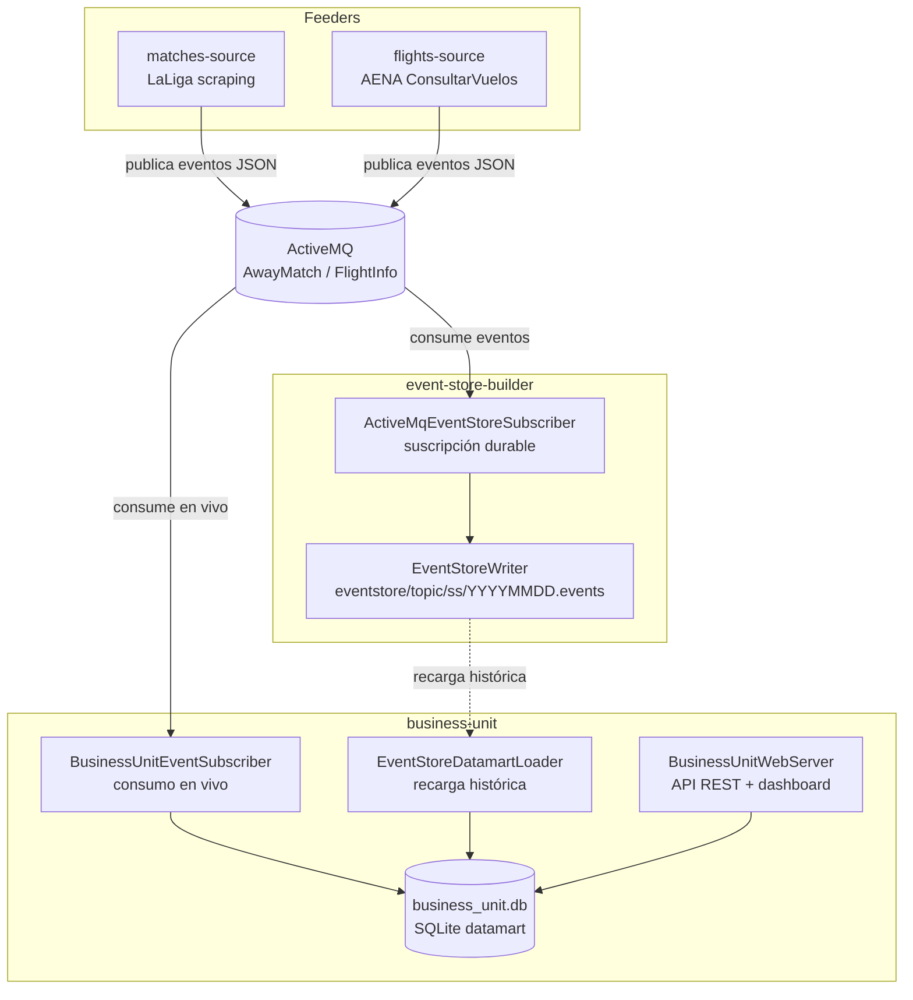
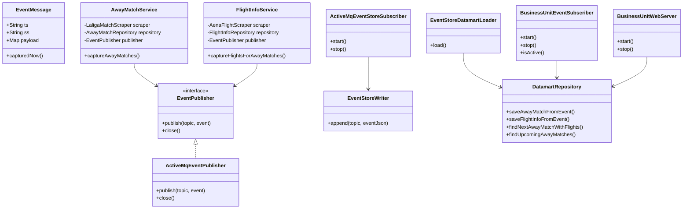

# PioPioFly

## Descripción

**PioPioFly** es un asistente de desplazamientos para aficionados de la **UD Las Palmas**. El sistema combina información de partidos fuera de casa, vuelos y entradas oficiales para ayudar al usuario a preparar un desplazamiento de forma sencilla.

El proyecto integra tres fuentes principales:

- **Partidos fuera de casa** obtenidos desde LaLiga mediante scraping.
- **Vuelos AENA** hacia el aeropuerto de destino del partido.
- **Entradas oficiales** mediante enlace directo a la plataforma de desplazamientos de UD Las Palmas en Onebox.

La información se transforma en eventos JSON, se publica en **ActiveMQ**, se persiste en un **event store** y se explota desde una **business unit** que mantiene un **datamart SQLite**. Sobre ese datamart se expone una **API REST** y un **dashboard web** para el usuario final.


## Propuesta de valor

La propuesta de valor de PioPioFly es centralizar en una única interfaz la información necesaria para que un aficionado pueda organizar un desplazamiento de la UD Las Palmas.

Desde el dashboard web (`http://localhost:8080`) el usuario puede consultar:

- El **próximo partido fuera de casa**.
- La ciudad, estadio y aeropuerto destino.
- Los **vuelos de ida disponibles** hacia el destino.
- Los **vuelos de vuelta disponibles**, si existen.
- Un botón para **comprar entrada** en la plataforma oficial de desplazamientos.
- Un botón para **buscar/ver vuelos** en Google Flights.
- Una lista de próximos partidos fuera de casa cargados en el datamart.

La interfaz final está pensada para un usuario no técnico, por lo que oculta controles internos como recargas de event store, sincronización ActiveMQ o información técnica del broker.

---

## Tipo de arquitectura: Lambda simplificada

La arquitectura final de PioPioFly se corresponde con una **arquitectura Lambda simplificada**.

Se ha elegido esta aproximación porque el sistema combina dos formas de explotación de datos:

1. **Capa de velocidad o tiempo real**  
   Los módulos feeders publican eventos en ActiveMQ y `business-unit` se suscribe a los topics `AwayMatch` y `FlightInfo` para actualizar el datamart conforme llegan nuevos eventos.

2. **Capa batch o histórica**  
   El módulo `event-store-builder` persiste los eventos recibidos en ficheros `.events` dentro del event store. Cuando es necesario reconstruir o inicializar el datamart, `business-unit` puede leer esos históricos mediante `EventStoreDatamartLoader`.

3. **Capa de servicio**  
   El datamart SQLite (`business_unit.db`) mantiene una vista optimizada para responder rápidamente a la API REST y al dashboard web.

No se considera una arquitectura Kappa pura porque el sistema no depende únicamente de reprocesar un único flujo de eventos. En este proyecto existen dos rutas diferenciadas hacia el datamart: consumo en vivo desde el broker y recarga histórica desde el event store.

---

## Arquitectura final del sistema

```text
┌─────────────────────────────────────────────────────────────┐
│                        FEEDERS                              │
│  ┌─────────────────────┐    ┌──────────────────────────┐    │
│  │  matches-source     │    │  flights-source           │    │
│  │  LaLiga scraping    │    │  AENA ConsultarVuelos     │    │
│  └────────┬────────────┘    └─────────────┬────────────┘    │
└───────────┼───────────────────────────────┼────────────────┘
            │ AwayMatch events              │ FlightInfo events
            ▼                               ▼
     ┌──────────────────────────────────────────┐
     │               ActiveMQ                   │
     │   topic: AwayMatch | topic: FlightInfo   │
     └────────────────┬─────────────────────────┘
                      │
          ┌───────────┴───────────────┐
          ▼                           ▼
 ┌─────────────────┐       ┌────────────────────────────┐
 │ event-store-    │       │       business-unit         │
 │ builder         │       │                            │
 │                 │       │  ┌────────────────────┐    │
 │ Subscriber      │       │  │ DatamartRepository │    │
 │ durable         │       │  │ SQLite datamart    │    │
 │                 │       │  └────────────────────┘    │
 │ eventstore/     │◄──────┤  ┌────────────────────┐    │
 │ {topic}/        │recarga│  │ EventStore loader  │    │
 │ {ss}/           │hist.  │  └────────────────────┘    │
 │ {YYYYMMDD}.events       │  ┌────────────────────┐    │
 └─────────────────┘       │  │ API REST + Web     │    │
                           │  │ localhost:8080     │    │
                           │  └────────────────────┘    │
                           └────────────────────────────┘
```

### Diagrama Mermaid



---

## Arquitectura de aplicación / módulos

El proyecto está organizado como un **monorepo Maven multimódulo**.

| Módulo | Descripción |
|---|---|
| `domain` | Entidades comunes, configuración compartida, `EventMessage`, `EventTopics`, publisher ActiveMQ y mapeo de aeropuertos. |
| `matches-source` | Feeder de partidos fuera de casa. Extrae datos de LaLiga, guarda en SQLite local y publica eventos `AwayMatch`. |
| `flights-source` | Feeder de vuelos. Consulta AENA mediante el endpoint `AENA_ConsultarVuelos`, guarda vuelos en SQLite local y publica eventos `FlightInfo`. |
| `app` | Módulo orquestador. Inicializa la base de datos local y ejecuta los servicios de captura de partidos y vuelos. |
| `event-store-builder` | Subscriber durable de ActiveMQ. Escucha eventos y los almacena en ficheros `.events` organizados por topic, fuente y fecha. |
| `business-unit` | Unidad de negocio. Mantiene el datamart SQLite, consume eventos en vivo, puede recargar históricos desde el event store y expone API REST + dashboard web. |

### Diagrama de clases principales



---

## APIs y fuentes usadas

### LaLiga — partidos fuera de casa

- **Fuente:** scraping de `laliga.com`.
- **Módulo:** `matches-source`.
- **Datos extraídos:** competición, equipo local, equipo visitante, fecha del partido, ciudad, estadio y aeropuerto destino.
- **Topic ActiveMQ:** `AwayMatch`.
- **Source (`ss`):** `laliga-matches-source`.

El mapeo de ciudad o rival a aeropuerto se resuelve en el dominio mediante `AirportMapping`.

### AENA — vuelos

- **Fuente:** endpoint `AENA_ConsultarVuelos` de `aena.es`.
- **Módulo:** `flights-source`.
- **Endpoint usado:**

```text
https://www.aena.es/sites/Satellite?pagename=AENA_ConsultarVuelos&airport={airport}&flightType={flightType}
```

- `flightType=S`: salidas.
- `flightType=L`: llegadas.
- **Datos extraídos:** número de vuelo, aerolínea, aeropuerto origen, aeropuerto destino, fecha/hora programada, estado y terminal.
- **Topic ActiveMQ:** `FlightInfo`.
- **Source (`ss`):** `aena-flights-source`.

Durante el desarrollo se detectaron problemas TLS/PKIX al consultar AENA desde Java en algunos entornos. Para mantener la captura real sin usar datos mock, el scraper puede usar `curl` como fallback remoto cuando la petición Java falla. Este fallback sigue consultando AENA de forma real y no inserta datos inventados.

### Onebox / UDLP Desplazamientos — entradas

- **Fuente:** plataforma oficial de desplazamientos UDLP en Onebox.
- **Uso:** enlace directo de compra en el dashboard.
- No se realiza scraping de entradas. El enlace se muestra al usuario para que pueda comprar en la web oficial.

### ActiveMQ — broker

- **Broker:** Apache ActiveMQ 5.x.
- **Puerto:** `tcp://localhost:61616`.
- **Topics usados:**
  - `AwayMatch`
  - `FlightInfo`

---

## Formato de eventos

Todos los eventos publicados en ActiveMQ y persistidos en el event store siguen la estructura común:

```json
{
  "ts": "2026-05-20T01:51:44.321733Z",
  "ss": "aena-flights-source",
  "payload": {
    "flightNumber": "VY8991",
    "airline": "Vueling",
    "originAirport": "LPA",
    "destinationAirport": "LCG",
    "scheduledDateTime": "2026-05-30T06:45",
    "status": null,
    "terminal": null,
    "source": "aena.es",
    "capturedAt": "2026-05-20T02:51:43.918858"
  }
}
```

| Campo | Descripción |
|---|---|
| `ts` | Timestamp UTC asociado al evento. |
| `ss` | Source/sender que identifica el módulo productor. |
| `payload` | Datos propios del evento: partido o vuelo. |

---

## Event Store

El módulo `event-store-builder` consume eventos desde ActiveMQ y los almacena en un event store local usando formato **JSON Lines / NDJSON**.

Estructura:

```text
eventstore/
├── AwayMatch/
│   └── laliga-matches-source/
│       └── 20260531.events
└── FlightInfo/
    └── aena-flights-source/
        └── 20260530.events
```

Cada fichero `.events` contiene un evento JSON por línea. Esta estrategia permite:

- escritura append-only;
- reprocesamiento posterior;
- reconstrucción del datamart;
- separación por topic, fuente y día.

---

## Datamart

### Base de datos: `business_unit.db`

La business unit mantiene un datamart local en **SQLite**. Se eligió SQLite porque:

- funciona en local sin servidor externo;
- es suficiente para el volumen de datos del proyecto;
- permite consultas rápidas por fecha, aeropuerto y fuente;
- se integra fácilmente con Java mediante JDBC;
- puede reconstruirse desde el event store.

### Tabla `away_matches_datamart`

Guarda los partidos fuera de casa recibidos desde `AwayMatch`.

| Columna | Descripción |
|---|---|
| `external_id` | Identificador externo del partido. |
| `competition` | Competición. |
| `home_team` | Equipo local. |
| `away_team` | Equipo visitante. |
| `match_date` | Fecha y hora del partido. |
| `city` | Ciudad. |
| `stadium` | Estadio. |
| `destination_airport` | Aeropuerto destino. |
| `source` | Fuente original. |
| `captured_at` | Momento de captura. |

### Tabla `flight_infos_datamart`

Guarda los vuelos recibidos desde `FlightInfo`.

| Columna | Descripción |
|---|---|
| `flight_number` | Número de vuelo. |
| `airline` | Aerolínea. |
| `origin_airport` | Aeropuerto origen. |
| `destination_airport` | Aeropuerto destino. |
| `scheduled_datetime` | Fecha y hora programada. |
| `status` | Estado del vuelo. |
| `terminal` | Terminal. |
| `source` | Fuente original. |
| `captured_at` | Momento de captura. |

### Idempotencia

El datamart usa índices únicos compuestos y operaciones:

```sql
INSERT ... ON CONFLICT ... DO UPDATE
```

Esto permite recibir o recargar eventos repetidos sin generar duplicados.

---

## Flujo en tiempo real

```text
matches-source / flights-source
        │
        │ publica EventMessage JSON
        ▼
     ActiveMQ
        │
        ├── event-store-builder
        │       └── eventstore/*.events
        │
        └── business-unit
                └── business_unit.db
                        └── API REST + dashboard
```

Los feeders publican eventos cada vez que se ejecuta el módulo `app`. En esta versión no se incluye un scheduler interno: la actualización se realiza lanzando de nuevo `Main` cuando se quiera refrescar la información.

La business unit puede consumir eventos en vivo mediante `BusinessUnitEventSubscriber`, usando un `clientId` fijo y lógica de reconexión para soportar caídas temporales de ActiveMQ.

---

## Flujo histórico

El flujo histórico permite reconstruir o inicializar el datamart leyendo los eventos persistidos previamente en el event store.

```text
eventstore/{topic}/{ss}/{YYYYMMDD}.events
        │
        ▼
EventStoreDatamartLoader
        │
        ▼
business_unit.db
```

La clase `EventStoreDatamartLoader` recorre los ficheros `.events`, parsea cada línea JSON y realiza upserts en el datamart.

Esto permite:

1. arrancar con el datamart vacío;
2. recargar eventos históricos;
3. combinar datos antiguos con eventos nuevos en tiempo real.

---

## Business Unit

El módulo `business-unit` es la unidad de negocio del sistema. Su objetivo es transformar eventos técnicos en información útil para el usuario final.

Funcionalidad principal:

- consultar el próximo partido fuera de casa;
- obtener vuelos de ida hacia el aeropuerto destino;
- obtener vuelos de vuelta si existen;
- ofrecer enlace de compra de entrada;
- ofrecer enlace de búsqueda del vuelo;
- exponer API REST;
- mostrar dashboard web.

La interfaz pública final es el dashboard web en:

```text
http://localhost:8080
```

La CLI existe como interfaz auxiliar, pero la interfaz principal para la entrega es la web.

---

## API REST de `business-unit`

La API REST se expone en `http://localhost:8080`.

| Método | Ruta | Descripción |
|---|---|---|
| `GET` | `/` | Dashboard web HTML. |
| `GET` | `/api/status` | Estado interno del sistema. Endpoint técnico. |
| `GET` | `/api/summary` | Resumen del datamart. Endpoint técnico. |
| `GET` | `/api/matches` | Partidos fuera de casa cargados. |
| `GET` | `/api/next-trip` | Siguiente desplazamiento con vuelos asociados. |
| `GET` | `/api/destinations` | Destinos disponibles en el datamart. Endpoint técnico. |
| `GET` | `/api/flights?destination=LCG` | Vuelos filtrados por destino. Endpoint técnico. |
| `GET` | `/api/recommendations` | Recomendaciones internas. No se muestra en el dashboard público. |
| `POST` | `/api/reload-eventstore` | Recarga histórica desde event store. Endpoint técnico. |
| `POST` | `/api/live-sync/start` | Inicia consumo en vivo desde ActiveMQ. Endpoint técnico. |
| `POST` | `/api/live-sync/stop` | Detiene consumo en vivo desde ActiveMQ. Endpoint técnico. |

### Ejemplos con `curl`

```bash
curl http://localhost:8080/api/next-trip
```

```bash
curl http://localhost:8080/api/matches
```

```bash
curl "http://localhost:8080/api/flights?destination=LCG"
```

```bash
curl http://localhost:8080/api/status
```

```bash
curl -X POST http://localhost:8080/api/reload-eventstore
```

---

## Requisitos previos

- Java 21.
- Maven 3.9+.
- Apache ActiveMQ 5.x.
- SQLite CLI, opcional para inspección.
- IntelliJ IDEA, recomendado.

En macOS, ActiveMQ puede instalarse con Homebrew:

```bash
brew install activemq
```

SQLite CLI:

```bash
brew install sqlite
```

---

## Cómo compilar

Con el Maven proporcionado por el entorno del curso:

```bash
../TrainerControl/.tools/apache-maven-3.9.9/bin/mvn \
  -Dmaven.repo.local=.m2/repository \
  clean install
```

Si Maven está instalado globalmente:

```bash
mvn clean install
```

---

## Cómo ejecutar la demo completa

### 1. Arrancar ActiveMQ

```bash
brew services start activemq
```

Comprobar que escucha en el puerto `61616`:

```bash
lsof -nP -iTCP:61616 -sTCP:LISTEN
```

La consola web de ActiveMQ suele estar disponible en:

```text
http://localhost:8161
```

Usuario y contraseña por defecto:

```text
admin / admin
```

---

### 2. Arrancar Event Store Builder

En una terminal:

```bash
../TrainerControl/.tools/apache-maven-3.9.9/bin/mvn \
  -Dmaven.repo.local=.m2/repository \
  -pl event-store-builder exec:java \
  -Dexec.mainClass=org.ulpgc.dacd.eventstore.EventStoreBuilderApp
```

Este proceso queda activo escuchando los topics y escribiendo eventos en `eventstore/`.

---

### 3. Ejecutar feeders mediante `app`

En otra terminal:

```bash
../TrainerControl/.tools/apache-maven-3.9.9/bin/mvn \
  -Dmaven.repo.local=.m2/repository \
  -pl app exec:java \
  -Dexec.mainClass=org.ulpgc.dacd.app.Main
```

Este comando:

1. inicializa SQLite local;
2. captura partidos fuera de casa;
3. obtiene vuelos AENA;
4. guarda datos en `pio_pio_fly.db`;
5. publica eventos en ActiveMQ.

---

### 4. Arrancar Business Unit

En otra terminal:

```bash
../TrainerControl/.tools/apache-maven-3.9.9/bin/mvn \
  -Dmaven.repo.local=.m2/repository \
  -pl business-unit exec:java \
  -Dexec.mainClass=org.ulpgc.dacd.business.BusinessUnitApp
```

---

### 5. Abrir dashboard web

```text
http://localhost:8080
```

---

## Caso de uso de demo

La demo final se centra en un desplazamiento realista de UD Las Palmas:

| Campo | Valor |
|---|---|
| Partido | RC Deportivo vs UD Las Palmas |
| Fecha | 2026-05-31 |
| Aeropuerto destino | LCG |
| Vuelo de ida capturado | VY8991 |
| Aerolínea | Vueling |
| Ruta | LPA → LCG |
| Fecha/hora | 2026-05-30T06:45 |

En el dashboard debe mostrarse:

- el siguiente desplazamiento;
- el botón **Comprar entrada**;
- vuelos de ida disponibles si están cargados;
- mensaje claro si no hay vuelos de vuelta;
- botón **Ver vuelo** para abrir búsqueda del vuelo.

---

## Consultas SQLite útiles

Inspeccionar vuelos capturados por los feeders:

```bash
sqlite3 pio_pio_fly.db \
  "SELECT flight_number, airline, origin_airport, destination_airport, scheduled_datetime, source
   FROM flight_infos
   ORDER BY scheduled_datetime;"
```

Comprobar vuelos LPA → LCG para el caso de demo:

```bash
sqlite3 pio_pio_fly.db \
  "SELECT flight_number, airline, origin_airport, destination_airport, scheduled_datetime, source
   FROM flight_infos
   WHERE origin_airport = 'LPA'
     AND destination_airport = 'LCG'
   ORDER BY scheduled_datetime;"
```

Inspeccionar el datamart:

```bash
sqlite3 business_unit.db \
  "SELECT home_team, away_team, match_date, destination_airport, source
   FROM away_matches_datamart;"
```

```bash
sqlite3 business_unit.db \
  "SELECT flight_number, airline, origin_airport, destination_airport, scheduled_datetime, source
   FROM flight_infos_datamart
   ORDER BY scheduled_datetime;"
```

---

## Datos de ejemplo

La carpeta `samples/` contiene muestras reducidas para evaluación:

```text
samples/
├── eventstore/
│   ├── AwayMatch/
│   │   └── laliga-matches-source/
│   │       └── 20260531.events
│   └── FlightInfo/
│       └── aena-flights-source/
│           └── 20260530.events
└── datamart/
    └── business_unit_sample.sql
```

Las muestras incluyen eventos representativos generados a partir del flujo real de la aplicación durante el desarrollo. Se incluyen únicamente para facilitar la evaluación sin versionar las bases de datos completas ni el event store local completo.

---

## Principios y patrones de diseño aplicados

### Publisher/Subscriber

Los feeders publican eventos en topics ActiveMQ. Los consumidores (`event-store-builder` y `business-unit`) se suscriben de forma independiente, lo que desacopla productores y consumidores.

### Event Store

Los eventos se guardan como ficheros `.events` en formato NDJSON. Este patrón permite conservar el histórico de eventos y reconstruir proyecciones posteriores.

### Datamart

La business unit mantiene un datamart SQLite optimizado para las consultas del dashboard. En lugar de consultar directamente el event store, se consulta una vista materializada y preparada para el usuario final.

### Repository

El acceso a SQLite se encapsula mediante repositorios:

- `AwayMatchRepository`
- `FlightInfoRepository`
- `DatamartRepository`

Esto separa la lógica de negocio del acceso a datos.

### Service

Los servicios coordinan tareas de alto nivel:

- `AwayMatchService`: scraping de partidos, guardado y publicación.
- `FlightInfoService`: captura de vuelos, guardado y publicación.

### Dependency Injection manual

Las dependencias se inyectan mediante constructores, sin frameworks externos. Esto facilita la lectura del código y evita acoplamiento innecesario.

### Idempotencia mediante upsert

El uso de `INSERT ... ON CONFLICT ... DO UPDATE` evita duplicados cuando se reejecutan feeders, se recargan históricos o se reciben eventos repetidos.

### Separación modular Maven

Cada responsabilidad está aislada en un módulo Maven distinto, mejorando la mantenibilidad del proyecto.

| Responsabilidad | Módulo |
|---|---|
| Dominio compartido | `domain` |
| Partidos | `matches-source` |
| Vuelos | `flights-source` |
| Orquestación | `app` |
| Event store | `event-store-builder` |
| Explotación de datos | `business-unit` |

---

## Limpieza del repositorio

No se versionan archivos generados ni dependencias locales.

Elementos ignorados:

| Elemento | Motivo |
|---|---|
| `target/` | Compilación Maven. |
| `.idea/` | Configuración local de IntelliJ. |
| `.m2/` | Repositorio local Maven. |
| `*.db` | Bases de datos SQLite generadas localmente. |
| `/eventstore/` | Event store completo generado en ejecución. |
| `aena_*.html` | Ficheros locales de depuración del scraper. |

La carpeta `samples/` sí se versiona porque contiene muestras reducidas útiles para la evaluación.

---